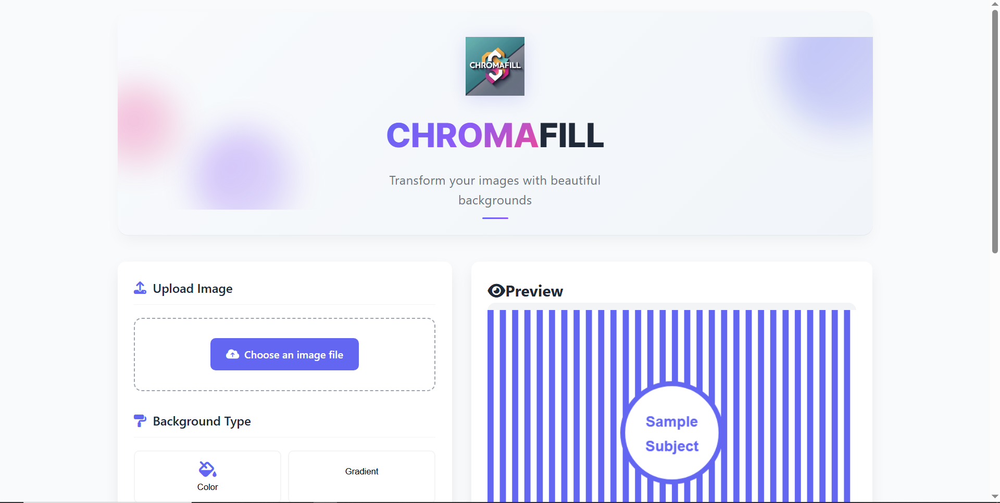
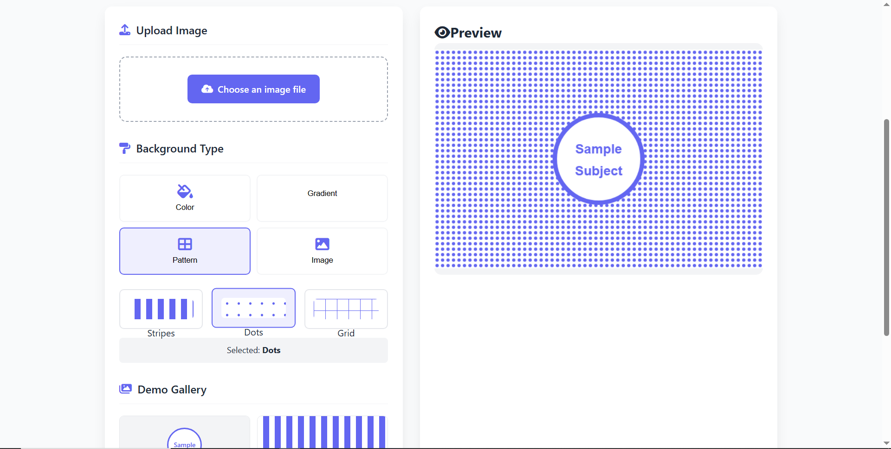
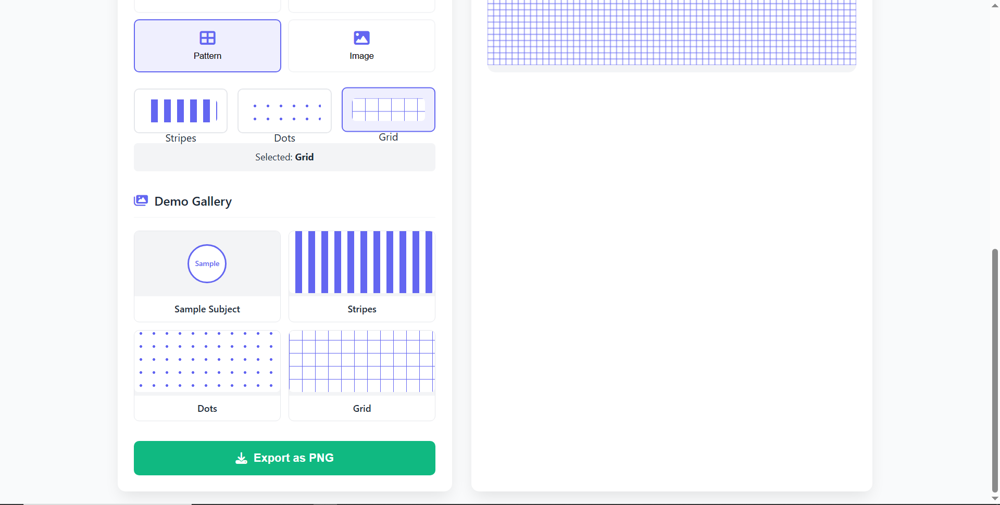
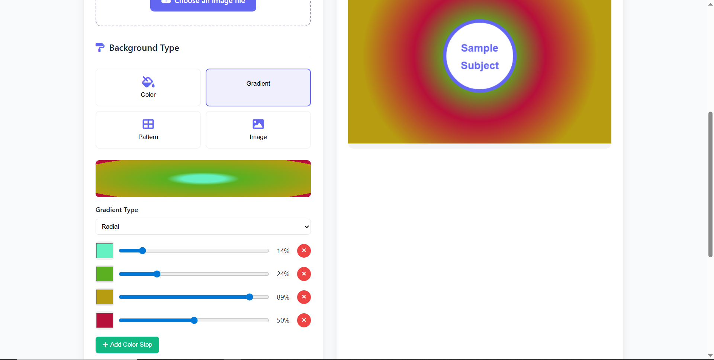
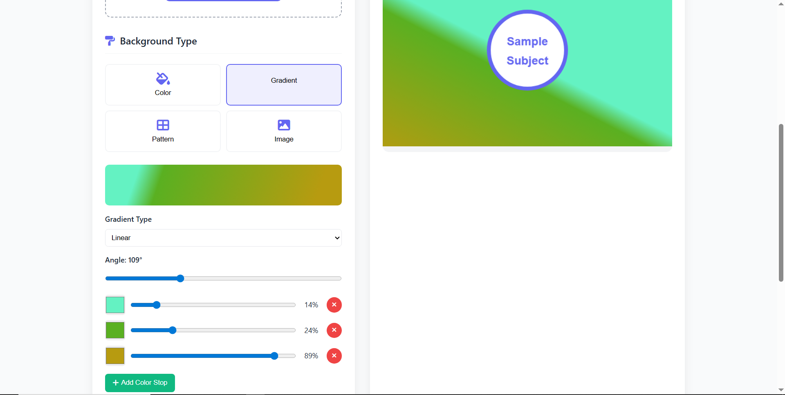

# [Chromafill](https://hesbon-osoro.github.io/chromafill/) - Transform Your Images with Beautiful Backgrounds

## 🌟 Welcome to Chromafill

[Chromafill](https://hesbon-osoro.github.io/chromafill/) is your creative playground for transforming ordinary images into stunning visual masterpieces. Imagine having the power to place your subject against any background you can dream up - vibrant colors, beautiful gradients, stylish patterns, or even other images.

It's like magic for your photos - instead of removing backgrounds, we help you create beautiful new ones!

## ✨ What Can You Do with Chromafill?

- **Upload any image** - Bring your favorite photos to life
- **Solid color backgrounds** - Choose from millions of colors
- **Custom gradients** - Create smooth color transitions
- **Stylish patterns** - Add dots, stripes, or grids
- **Image backgrounds** - Place your subject against any scene
- **Export high-quality results** - Save your creations as PNG files

## 🎨 How to Get Started (It's Easy!)

1. **Upload your image** - Click the upload button and select any photo
2. **Choose your background** - Pick from colors, gradients, patterns, or images
3. **Customize to perfection** - Adjust colors, angles, and styles
4. **Download your creation** - Export your transformed image with one click

No technical skills needed - just your creativity!

## 🚀 Try It Now!

Experience the magic yourself: [https://hesbon-osoro.github.io/chromafill/](https://hesbon-osoro.github.io/chromafill/)

## 💡 Perfect For

- Social media content creators
- Bloggers and website owners
- Small business marketing materials
- Personal photo editing
- Anyone who wants to make their images pop!

## 🔍 Why Don't I See the Eyedropper Feature?

The eyedropper tool is a handy feature that lets you pick colors directly from your screen. However, this feature requires a modern browser that supports the **EyeDropper API**.

**If you don't see the eyedropper:**

- You might be using an older browser
- You might be using Safari (which doesn't yet support this feature)
- Your browser may have security restrictions preventing this feature

**To use the eyedropper:**

- Try updating to the latest version of Chrome, Edge, or Firefox
- Ensure you're using a supported browser

Don't worry though - you can still manually enter any color code or use our color picker even without the eyedropper feature!

## 📱 Works Everywhere

Chromafill works on:

- Desktop computers (Windows, Mac, Linux)
- Laptops
- Tablets
- Smartphones

## 🆓 Completely Free

Yes, you read that right! Chromafill is completely free to use with no hidden costs or watermarks on your exported images.

## 🔗 Share Your Creations

We'd love to see what you create with Chromafill! Share your transformed images on social media and tag them with **#ChromafillMagic** to inspire others.

---

_Chromafill - Where ordinary images become extraordinary creations._
